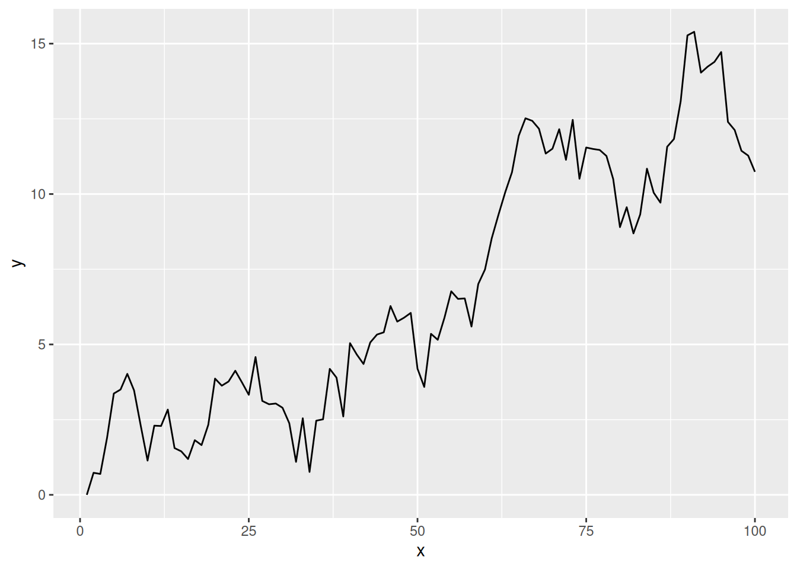
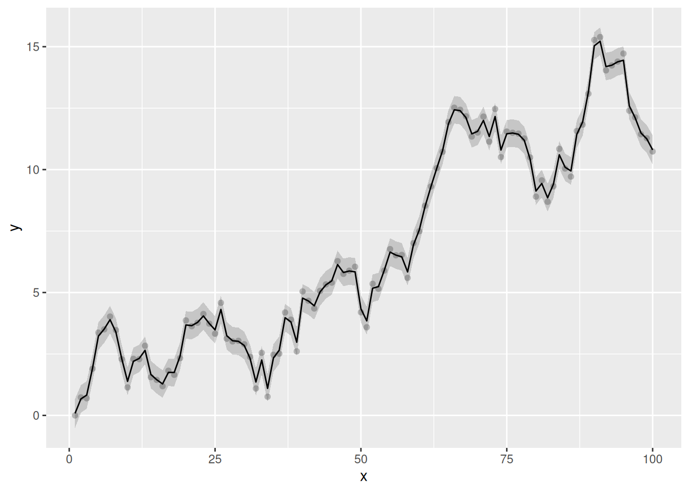
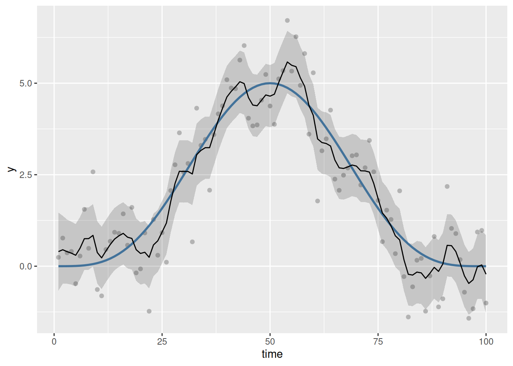
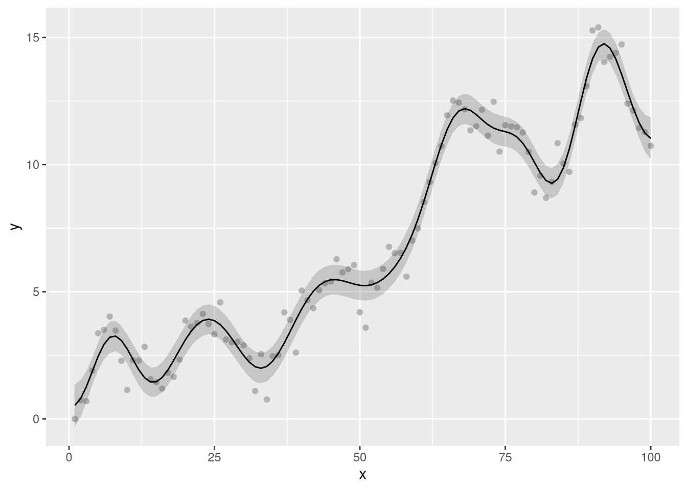
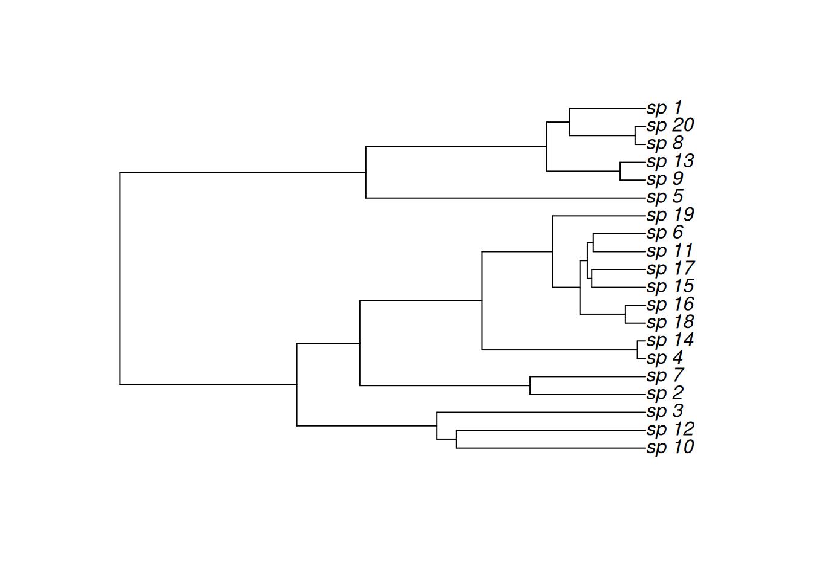
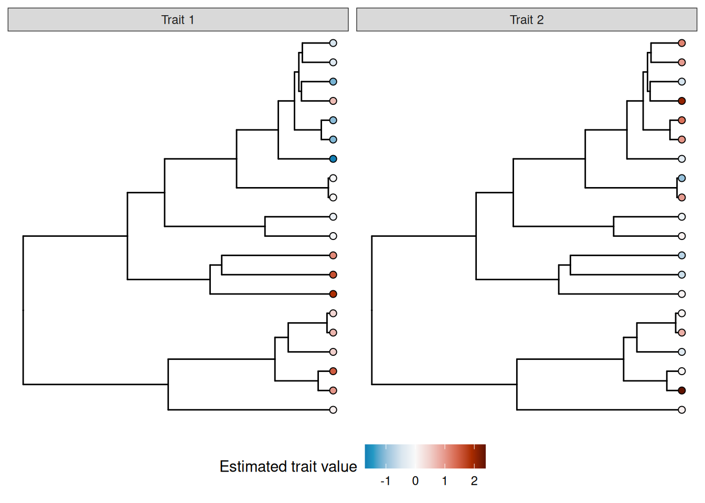

# Getting started with the MRFtools package

The Gaussian Markov random field basis (`bs = "mrf"`) in *mgcv* is an
extremely powerful and flexible “spline”, which can be used to include a
range of effects into a GAM that one would not typically think of as
smooth effects. As with many powerful tools in R, that power and
flexibility can often bring with it additional complexity when you try
to actually use the thing.

The MRF basis (`bs = "mrf"`) allows for the definition of a Gaussian MRF
in one of three ways

1.  `polys` — providing a list containing numeric vectors of points
    defining one or more polygons, one per level of the factor provided
    to the smooth, where the spatial arrangement of polygons is used to
    build a neighbourhood structure and from that a penalty matrix
    $\mathbf{S}$,

2.  `nb` — providing the neighbourhood structure itself, as a list, with
    one element per level of the factor supplied to the smooth. Each
    element of this list provides the indices of the levels for the
    neighbours of that element. From this list, the corresponding
    penalty matrix $\mathbf{S}$ is created, and

3.  `penalty` — providing the penalty matrix $\mathbf{S}$ directly.

The flexibility of the MRF basis arises from the last of these — the
ability to provide a penalty matrix directly. However, many users of
*mgcv* are unlikely to be able to specify `penalty` themselves,
especially because there are some strict rules that must be followed in
order for the correct $\mathbf{S}$ to be specified without producing an
error from *mgcv*. *MRFtools* aims to take some of the pain out of using
the MRF basis by providing functions that create the `penalty` matrix
for you for a range of commonly encountered R objects and structures.

This vignette will briefly describe how to use *MRFtools* to specify a
penalty matrix, and how to use that penalty matrix with *mgcv*. The aim
is to demonstrate the basic workflow, not to provide an exhaustive
overview of *MRFtools* capabilities. Also, the specific details of
workflow are in a bit of flux as Eric and I work towards an initial CRAN
release of *MRFtools*.

## Installing *MRFtools*

If you have the tools to build source packages, you can use the
*remotes* package to install *MRFtools*.

``` r
# do we need to install remotes?
if (isFALSE(require("remotes"))) {
  install.packages("remotes")
}
remotes::install_github("eric-pedersen/MRFtools")
```

Soon, we’ll have *MRFtools* available for installation via ROpenSci’s R
Universe system.

## Setup

To follow this vignette, you’ll need the following packages

``` r
pkgs <- c("ape", "mgcv", "MRFtools", "dplyr", "ggplot2", "gratia", "ggtree")
```

The *ggtree* package is from BioConductor, so if you do not have it
installed, you’ll need to install the *BiocManager* package first to
perform the installation:

``` r
if (!require("BiocManager", quietly = TRUE))
  install.packages("BiocManager")

BiocManager::install("ggtree")
```

``` r
vapply(
  pkgs,
  library,
  logical(1),
  character.only = TRUE,
  logical.return = TRUE
)
```

         ape     mgcv MRFtools    dplyr  ggplot2   gratia   ggtree
        TRUE     TRUE     TRUE     TRUE     TRUE     TRUE     TRUE 

## Discrete random walks

One of the ways in which regular temporal data can be modelled in
general is through a discrete random walk (RW). In this section I’ll
illustrate how to create the corresponding penalty matrix $\mathbf{S}$
for a first order discrete random walk and include this in a GAM.

A discrete first order random walk (RW1) is defined by

$$x_{1} \sim \mathcal{N}(0,\sigma^{2}),\qquad x_{t} = x_{t - 1} + \varepsilon_{t},\qquad\varepsilon_{t} \sim \mathcal{N}(0,\tau^{-1}).$$

We can simulate a RW1 using the following function

``` r
rw1_sim <- function(n, sigma = 1, tau = 1) {
  # n    = length of the random walk
  # sigma = sd of initial state x1
  # tau   = precision of increments (var = 1/tau)

  # initial state
  x <- numeric(n)
  x[1] <- rnorm(1, mean = 0, sd = sigma)

  # RW1 increments
  eps <- rnorm(n - 1, mean = 0, sd = 1 / sqrt(tau))

  # accumulate
  x[2:n] <- x[1] + cumsum(eps)

  x
}
rw1_sim <- function(n, sigma = 1, x0 = 0) {
  c(x0, x0 + cumsum(rnorm(n - 1, 0, sigma)))
}
```

Let’s simulate a 100 time step series from a RW1 and store the data in a
data frame

``` r
df <- tibble(
  y = withr::with_seed(2026 - 3 - 24, rw1_sim(n = 100)),
  x = seq_len(100)
)
```

and visualise it

``` r
df |>
  ggplot(
    aes(x = x, y = y)
  ) +
  geom_line()
```



To model this time series using a Gaussian MRF and the MRF basis, we
need to do a couple of things to prepare the data for *mgcv*

1.  Create the penalty matrix $\mathbf{S}$, and

2.  Coerce the time covariate, here `x`, into a factor.

This latter step seems an odd thing to do for a time series, but it is a
requirement of *mgcv* and reflects the original intention of modelling
discrete areal data.

### Creating $\mathbf{S}$

The penalty matrix $S$ is created using
[`mrf_penalty()`](https://gam-mafia.github.io/MRFtools/reference/mrf_penalty.md),
which for the RW1 talks a vector of regularly spaced discrete time
points. To create $S$ for our series, we use

``` r
S <- with(df, mrf_penalty(x))
```

This creates an `"mrf_penalty"` object, a matrix with some extra
attributes:

``` r
S
```

    Markov Random Field penalty
    Type: sequential
    N   : 100

As it is a little cumbersome to visualize a 100 by 100 matrix, we’ll
repeat the above using on the first 10 time points

``` r
with(df, mrf_penalty(x[1:10])) |>
  as.matrix()
```

        1  2  3  4  5  6  7  8  9 10
    1   1 -1  0  0  0  0  0  0  0  0
    2  -1  2 -1  0  0  0  0  0  0  0
    3   0 -1  2 -1  0  0  0  0  0  0
    4   0  0 -1  2 -1  0  0  0  0  0
    5   0  0  0 -1  2 -1  0  0  0  0
    6   0  0  0  0 -1  2 -1  0  0  0
    7   0  0  0  0  0 -1  2 -1  0  0
    8   0  0  0  0  0  0 -1  2 -1  0
    9   0  0  0  0  0  0  0 -1  2 -1
    10  0  0  0  0  0  0  0  0 -1  1

The negative values on the off-diagonals indicate that a pair of samples
are (temporal) neighbours. The diagonal of the matrix counts the number
of neighbours for each observation. At the start and end time points of
the series, the observations have a single neighbour, while the
intermediate time points have two neighbours: the observation prior
($x_{t - 1}$ and the one after ($x_{t + 1}$) $x_{t}$.

### Creating the data

The second step, creating a factor with the correct levels, is required
for *mgcv* to align observations for each *unit* with a particular row
and column of $S$. This is done by using a factor for the time variable,
where the levels of the factor identify the time points. This
construction allows for multiple observations for each row/column in
$S$. We’ll look at examples like that in other vignettes. For now, we
just need to create a new factor, `fx`, from `x` with the correct
levels.

``` r
df <- df |>
  mutate(
    fx = factor(x, levels = x)
  )
```

### Fitting the model

Now we are ready to fit the GAM using *mgcv*

``` r
m_rw1 <- gam(
  y ~ s(fx, bs = "mrf", xt = list(penalty = S)),
  data = df,
  method = "REML"
)
```

Instead of using a smooth of $x$, as we would in a typical GAM, we
request a smooth of the factor `fx`. The `bs` argument allows us to
specify the type of basis to use for the smooth function. Here, we
specify `"mrf"` to use the Gaussian MRF basis. The final step is to pass
the penalty matrix to the smooth constructor, which we do through the
`xt` argument. This needs to be a list, and as we are passing the
penalty matrix, we need to name the element of this list `penalty`.

### Visualising the fitted smooth

Neither *mgcv* nor *gratia* are currently capable of plotting arbitrary
MRF smooths of the type we just fitted. We plan on providing plotting
methods that can be used by *gratia*, but these are yet to be
implemented. Instead, we can evaluate the fitted model at the observed
time points and plot the predicted values.

``` r
m_rw1 |>
  fitted_values() |>
  mutate(x = as.character(fx) |> as.numeric()) |>
  ggplot(
    aes(x = x, y = .fitted)
  ) +
  geom_point(
    data = df,
    aes(x = x, y = y),
    col = "grey70"
  ) +
  geom_ribbon(
    aes(ymin = .lower_ci, ymax = .upper_ci),
    alpha = 0.2
  ) +
  geom_line()
```



The fitted trend is extremely wiggly and, by the usual conventions of
models involving smooths, not very, well, smooth. This isn’t surprising
in this case, however, as the underlying data generation process is a
RW1. Importantly, the fitted trend hasn’t interpolated the data; there
has been some shrinkage of the coefficients. This is a full-rank MRF,
with $n - 1$ (99) basis functions. If we consult the model summary, we
that the effective degrees of freedom for the fitted trend is 79.05

``` r
overview(m_rw1)
```

    Generalized Additive Model with 2 terms

      term      type           k   edf ref.edf statistic p.value
      <chr>     <chr>      <dbl> <dbl>   <dbl>     <dbl> <chr>
    1 Intercept parametric    NA   1         1      213. <0.001
    2 s(fx)     MRF           99  79.0      99      180. <0.001 

The trend uses ~20 fewer degrees of freedom than theoretically possible
given the RW1 penalty allows.

How does the discrete RW1 work with a different underlying model? In the
next example we simulate autocorrelated observations from the smooth
function

$$(1280*x_{t}^{4})*(1 - x_{t})^{4}.$$

To simulate from this function plus AR(1) noise we can use

``` r
sim_fun <- function(n = 100, rho) {
  time <- 1:n
  xt <- time / n
  Y <- (1280 * xt^4) * (1 - xt)^4
  y <- as.numeric(Y + arima.sim(list(ar = rho), n = n))
  tibble(y = y, time = time, f = Y)
}
```

which we use to generate 100 observations, with moderate autocorrelation
($\rho$ = 0.1713)

``` r
df2 <- withr::with_seed(
  321,
  sim_fun(rho = 0.1713)
)
```

Next, we generate the penalty matrix for these observations

``` r
S2 <- with(df2, mrf_penalty(time))
```

As there are 100 observations, this and the earlier penalty matrix are
identical as there are the same number of time points and they have the
same labels.

To create the factor, we can use the
[`get_labels()`](https://gam-mafia.github.io/MRFtools/reference/get_labels.md)
helper function. This will ensure that the factor of time points we
create has the correct levels

``` r
df2 <- df2 |>
  mutate(
    f_time = factor(time, levels = get_labels(S2))
  )
```

While
[`get_labels()`](https://gam-mafia.github.io/MRFtools/reference/get_labels.md)
is not necessary here, there are many situations where you will want to
create the penalty matrix for a set of levels, some of which are not
observed in the data you will use to fit the model. Careful construction
of the factor you will pass to the MRF smooth is required in those
cases.

Now we can fit the GAM to the simulated data, again passing along the
penalty matrix to the `xt` argument of *mgcv*’s `s()` function

``` r
m2_rw1 <- gam(
  y ~ s(f_time, bs = "mrf", xt = list(penalty = S2)),
  data = df2,
  method = "REML"
)
```

Looking at the model summary we see strong penalization.

``` r
overview(m2_rw1)
```

    Generalized Additive Model with 2 terms

      term      type           k   edf ref.edf statistic p.value
      <chr>     <chr>      <dbl> <dbl>   <dbl>     <dbl> <chr>
    1 Intercept parametric    NA   1         1     24.3  <0.001
    2 s(f_time) MRF           99  26.7      99      5.35 <0.001 

As with the previous example, the smooth was initialised with 99 basis
functions (number of time points - 1), but the smoothness selection
process has shrunk the coefficients for the basis functions to the
extent that the fitted smooth uses just 26.73 effective degrees of
freedom.

Plotting the fitted smooth is again illustrative of the behaviour of the
discrete RW1:

``` r
m2_rw1 |>
  fitted_values() |>
  mutate(time = as.character(f_time) |> as.numeric()) |>
  ggplot(
    aes(x = time, y = .fitted)
  ) +
  geom_point(
    data = df2,
    aes(x = time, y = y),
    col = "grey70"
  ) +
  geom_line(
    data = df2,
    aes(y = f),
    col = "steelblue",
    linewidth = 1
  ) +
  geom_ribbon(
    aes(ymin = .lower_ci, ymax = .upper_ci),
    alpha = 0.2
  ) +
  geom_line()
```



Despite the underlying model being smooth, we do not achieve a visually
smooth fit (in the usual sense). The model has overfitted the sample of
data; it has done this because as far as the RW1 is concerned, the AR(1)
noise is part of the signal we tasked the model with finding when we
fitted the RW1 process.

If we believe the true relationship between, in this case, time and the
response, $Y$, is smooth (in the usual sense), then we should instead
fit a model using one of the standard spline bases provided by *mgcv*.
The RW1, and most models that
[`mrf_penalty()`](https://gam-mafia.github.io/MRFtools/reference/mrf_penalty.md)
can (or is planned to) fit, are for use when we want to fit a stochastic
trend to the data.

That said, we *can* get a smoother fit using the RW1 penalty; we just
need to reduce the dimensionality of the penalty we use. Instead of
creating the rull penalty matrix, here

``` r
dim(S)
```

    [1] 100 100

we instead can fit a reduced rank penalty, by setting `k` for the smooth
to a lower value than 99.

Returning to the original example, we fit a visually smooth RW1 by
restricting `k` so that the penalty uses at most 20 basis functions.
Note that this is done when specifying the smooth in the model formula;
we still need to pass the full RW1 penalty matrix to `gam()`:

``` r
m3_rw1 <- gam(
  y ~ s(fx, bs = "mrf", xt = list(penalty = S), k = 20),
  data = df,
  method = "REML"
)
```

When we visualise the model predictions, we note that the fitted smooth
is now, well, smooth:

``` r
m3_rw1 |>
  fitted_values() |>
  mutate(x = as.character(fx) |> as.numeric()) |>
  ggplot(
    aes(x = x, y = .fitted)
  ) +
  geom_point(
    data = df,
    aes(x = x, y = y),
    col = "grey70"
  ) +
  geom_ribbon(
    aes(ymin = .lower_ci, ymax = .upper_ci),
    alpha = 0.2
  ) +
  geom_line()
```



While this is of interest in developign an understanding of how MRF
smooths work, for practical purposes it is of limited interest in this
case. The choice of `k = 20` is not the *optimal* complexity for these
data — we already saw that optimal function used ~20 EDF — and as a user
you are free to set `k` to whatever value you want (as long as it is
less $n_{t}$ and greater than 2.) If you want to obtained a smooth
trend, you would be better served with one of *mgcv*’s standard
smoothers, and perhaps fit the model using NCV or include an
autocorrelation process (via `bam()` or `gamm()` say).

## Phylogenetic smooths

Next, we consider how to include phylogenetic information into a GAM,
such that genetically more-similar species are assumed to have more
similar response values than more genetically distant taxa. We could
include species identity as a random intercept term in the model, but
individual species means (intercepts) would be shrunk more or less to 0;
nothing would help pull genetically similar taxa toward one another. A
Gaussian MRF is a general way to represent graphical information, which
makes it ideal for representing phylogenetic trees.

The example below is a simplified version of Nick Clark’s [blog
post](https://ecogambler.netlify.app/blog/phylogenetic-smooths-mgcv/) on
including phylogenetic information into GAMs. Users of *MRFtools* are
encouraged to read Nick’s post as it represents an excellent use case
for a hierarchical GAM (sensu [Pedersen et al.
2019](#ref-pedersen-miller-etal-2019)) and of *MRFtools* to include
phylogenetic information into the model.

We being by simulating a simple phylogenetic tree using the *ape*
package

``` r
n_species <- 20
tree <- withr::with_seed(
  2026-3-25,
  rcoal(n_species, tip.label = paste0('sp_', seq_len(n_species)))
)
species_names <- tree$tip.label
plot(tree)
```



Next, we simulate some response data for each species to demonstrate the
utility of the MRF smoothers. Here, we assume that we have observed some
outcomes $y_{1}$ and $y_{2}$ for multiple individuals from each species
in our dataset.

The species-level mean value ($\mu_{1}$) for trait $y_{1}$ follows a
phylogenetic random walk (specifically an OU model). The species-level
mean value for trait $y_{2}$ ($\mu_{2}$) is not conserved; it is
normally distributed at the species level.

We will also generate some observation-level error for each trait in
each observed individual.

``` r
n_obs <- 5
withr::with_seed(
  seed = 20260326,
{
  mu1 <- rTraitCont(tree,model = "OU",sigma = 0.05, alpha=0.2) |>
    scale(center = FALSE, scale = TRUE) |>
    as.vector()
  mu2 <- rnorm(n_species) |>
    scale(center = FALSE, scale = TRUE) |>
    as.vector()

  e1 <- rnorm(n_species*n_obs, mean = 0, sd = 0.5)
  e2 <- rnorm(n_species*n_obs, mean = 0, sd = 0.5)
}
)

phylo_df <- tibble(
  species = rep(species_names, times = n_obs),
  mu1 = rep(mu1, times = n_obs),
  mu2 = rep(mu2, times = n_obs),
  y1 = mu1 + e1,
  y2 = mu2 + e2
)

phylo_df
```

    # A tibble: 100 × 5
       species     mu1     mu2      y1     y2
       <chr>     <dbl>   <dbl>   <dbl>  <dbl>
     1 sp_10    1.60   -0.580   1.17   -0.781
     2 sp_12    1.12   -0.728   0.508  -0.672
     3 sp_3     1.88    0.0687  1.67   -0.614
     4 sp_2    -0.0877  0.112   0.0950  0.613
     5 sp_7    -0.213  -0.177  -0.170  -0.379
     6 sp_4     0.0419  0.975   0.218   1.57
     7 sp_14   -0.0167 -0.974  -0.580  -1.24
     8 sp_18   -1.09    1.03   -1.02    0.431
     9 sp_16   -1.03    1.33   -0.882   1.29
    10 sp_15    0.667   2.06    0.154   2.13
    # ℹ 90 more rows

We can visualize the distribution of true means of the two traits across
the tree using the `ggtree` package:

``` r
library(ggtree)
mu1_tree <- data.frame(label=tree$tip.label, variable = mu1) |>
  full_join(tree,y = _, by = "label")

mu2_tree <- data.frame(label=tree$tip.label, variable = mu2) |>
  full_join(tree,y = _, by = "label")

trs <- list(`Trait 1` = mu1_tree, `Trait 2` = mu2_tree)
class(trs) <- 'treedataList'

trait_plot = ggtree(trs) + 
  facet_wrap(~.id) +
  geom_tippoint(aes(colour=variable))+ 
  scale_colour_gradient2("mean trait value", 
                         low = "blue",high = "red") +
  theme(legend.position = "bottom")

trait_plot
```



*MRFtools* has a
[`mrf_penalty()`](https://gam-mafia.github.io/MRFtools/reference/mrf_penalty.md)
method for phylogentic trees like `tree`; at the time of writing we
support both the `"phylo"` class from package *ape* and the `"phylo4"`
class from *phylobase*. To create the phylogenetic penalty matrix, we
pass `tree` to
[`mrf_penalty()`](https://gam-mafia.github.io/MRFtools/reference/mrf_penalty.md).

``` r
S_phylo <- mrf_penalty(tree)
```

The default penalty for phylogenies is “rw1”, which is a first-order
random walk model of trait evolution (synonymous with the standard
“Brownian motion” model of trait evolution). Also by default, the
penalty matrix generated is for the entire tree (including internal
nodes)[¹](#fn1). The precision matrix ($Q$) for “rw1” for a whole tree
is:

$$Q_{i,j} = \begin{cases}
{-1/l_{ij}} & {{\text{if}\mspace{6mu}}i \neq j{\mspace{6mu}\text{and node i is a direct ancestor/descendant of j}}} \\
{\sum\limits_{k \neq i} - Q_{ik}} & {{\text{if}\mspace{6mu}}i = j} \\
0 & {\mspace{6mu}\text{otherwise}}
\end{cases}$$

This is a model of continuous trait evolution via a random walk wherein
phenotypic change accumulates in both directions at random. Future
versions of *MRFtools* will support alternative models for phenotypic
change.

Since our penalty matrix includes levels for both the observed species
(tips) and their common ancestors (nodes), we need to add those extra
node names into the data. We will create a second factor variable
(`species_plus`) to denote the augmented vector of species names.

``` r
#|label: relabel-phylo

phylo_df <- phylo_df |>
  mutate(
    species  = factor(species), 
    species_plus = factor(species, levels = get_labels(S_phylo)))
```

We will fit one model to each of the two traits.

As with the previous examples, we pass the `species_plus` factor to
`s()`, set the basis to `"mrf"`, and provide the penalty matrix via the
`xt` argument. We have also included a standard random effect smoother,
to help assess the degree of phylogenetic information in the variable;
if there is little phylogenetic information, the phylogenetic smoother
will be shrunk toward zero, whereas if there is strong phylogenetic
signal, the random effect smoother will be shrunk toward zero (as the
model is able to capture the amount of interspecific variation in trait
means using fewer degrees of freedom from the phylogenetic smoother).

We also have to specify `drop.unused.levels = FALSE` within the gam, as
otherwise `mgcv` will treat the unobserved nodes as missing and drop
them from the model.

``` r
m_phylo1 <- gam(
  y1 ~ s(species_plus, bs = "mrf", xt = list(penalty = S_phylo)) +
       s(species, bs = "re"),
  data = phylo_df,
  method = "REML", 
  drop.unused.levels = FALSE
)

m_phylo2 <- gam(
  y2 ~ s(species_plus, bs = "mrf", xt = list(penalty = S_phylo)) +
       s(species, bs = "re"),
  data = phylo_df,
  method = "REML", 
  drop.unused.levels = FALSE
)
```

``` r
overview(m_phylo1)
```

    Generalized Additive Model with 3 terms

      term            type              k       edf ref.edf  statistic p.value
      <chr>           <chr>         <dbl>     <dbl>   <dbl>      <dbl> <chr>
    1 Intercept       parametric       NA  1              1  3.64      <0.001
    2 s(species_plus) MRF              38 16.7           19 26.2       <0.001
    3 s(species)      Random effect    20  0.000826      19  0.0000430 0.0135 

We can see that the MRF term in the first model ends up with a large
assigned degrees of freedom (edf) with almost no edf for the random
effect term, indicating a strong phylogenetic signal in the trait value.

Now let’s look at the overview for the second model:

``` r
overview(m_phylo2)
```

    Generalized Additive Model with 3 terms

      term            type              k    edf ref.edf statistic p.value
      <chr>           <chr>         <dbl>  <dbl>   <dbl>     <dbl> <chr>
    1 Intercept       parametric       NA  1           1      2.23 0.0287
    2 s(species_plus) MRF              38  0.927      19      1.72 0.3520
    3 s(species)      Random effect    20 16.8        19      9.39 <0.001 

We can see that there is almost no variation assigned to the MRF, while
the random effect term has an EDF almost equal to the number of species.

## References

Pedersen, Eric J, David L Miller, Gavin L Simpson, and Noam Ross. 2019.
“Hierarchical Generalized Additive Models in Ecology: An Introduction
with Mgcv.” *PeerJ* 7: e6876. <https://doi.org/10.7717/peerj.6876>.

------------------------------------------------------------------------

1.  If you want instead to calculate a penalty for just the observed
    species (excluding internal nodes), you can set the option
    `internal_nodes = FALSE` inside the `mrf_penalty` call.
